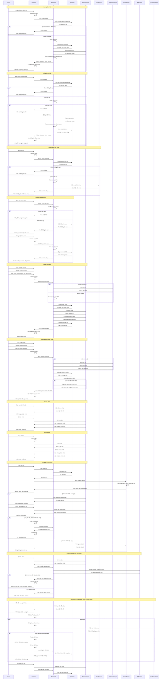

```mermaid
sequenceDiagram
    participant User
    participant Frontend
    participant Backend
    participant Database
    participant StreamServer
    participant EmailService
    participant FirebaseStorage
    participant SocketServer
    participant AIProvider
    participant FaceDetectionAI

    %% Đăng ký
    Note over User,StreamServer: Luồng đăng ký
    User->>Frontend: Nhập thông tin đăng ký
    Frontend->>Frontend: Validate dữ liệu
    Frontend->>Backend: POST /api/register
    Backend->>Database: Kiểm tra username/email tồn tại
    Database-->>Backend: Kết quả kiểm tra
    alt Username/Email đã tồn tại
        Backend-->>Frontend: Trả về lỗi 409
        Frontend-->>User: Hiển thị thông báo lỗi
    else Thông tin hợp lệ
        Backend->>Backend: Hash password
        Backend->>Database: Lưu thông tin user mới
        Database-->>Backend: Xác nhận lưu thành công
        Backend->>StreamServer: Tạo stream token
        StreamServer-->>Backend: Trả về stream token
        Backend->>Backend: Tạo access token và refresh token
        Backend-->>Frontend: Trả về tokens và thông tin user
        Frontend->>Frontend: Lưu thông tin đăng nhập
        Frontend-->>User: Chuyển hướng về trang chủ
    end

    %% Đăng nhập
    Note over User,StreamServer: Luồng đăng nhập
    User->>Frontend: Nhập thông tin đăng nhập
    Frontend->>Backend: POST /api/auth
    Backend->>Database: Tìm user theo username/email
    Database-->>Backend: Kết quả tìm kiếm
    alt User không tồn tại
        Backend-->>Frontend: Trả về lỗi 400
        Frontend-->>User: Hiển thị thông báo lỗi
    else User tồn tại
        Backend->>Backend: Verify password
        alt Sai mật khẩu
            Backend-->>Frontend: Trả về lỗi 400
            Frontend-->>User: Hiển thị thông báo lỗi
        else Đúng mật khẩu
            Backend->>StreamServer: Tạo stream token
            StreamServer-->>Backend: Trả về stream token
            Backend->>Backend: Tạo access token và refresh token
            Backend->>Database: Lưu refresh token
            Database-->>Backend: Xác nhận lưu thành công
            Backend-->>Frontend: Trả về tokens và thông tin user
            Frontend->>Frontend: Lưu thông tin đăng nhập
            Frontend-->>User: Chuyển hướng về trang chủ
        end
    end

    %% Quên mật khẩu
    Note over User,EmailService: Luồng quên mật khẩu
    User->>Frontend: Nhập email
    Frontend->>Frontend: Validate email
    Frontend->>Backend: POST /api/auth/forgot
    Backend->>Database: Kiểm tra email tồn tại
    Database-->>Backend: Kết quả kiểm tra
    alt Email không tồn tại
        Backend-->>Frontend: Trả về lỗi 409
        Frontend-->>User: Hiển thị thông báo lỗi
    else Email tồn tại
        Backend->>Backend: Tạo recovery token
        Backend->>EmailService: Gửi email khôi phục
        EmailService-->>Backend: Xác nhận gửi email
        Backend-->>Frontend: Trả về thành công
        Frontend-->>User: Hiển thị thông báo kiểm tra email
    end

    %% Lấy lại mật khẩu
    Note over User,Database: Luồng lấy lại mật khẩu
    User->>Frontend: Click link trong email
    Frontend->>Backend: POST /api/auth/verify
    Backend->>Backend: Verify recovery token
    alt Token hết hạn
        Backend-->>Frontend: Trả về lỗi 403
        Frontend-->>User: Chuyển hướng về trang 404
    else Token hợp lệ
        Backend->>Database: Lấy thông tin user
        Database-->>Backend: Trả về thông tin user
        Backend-->>Frontend: Trả về thông tin user
        Frontend-->>User: Hiển thị form đặt mật khẩu mới
        User->>Frontend: Nhập mật khẩu mới
        Frontend->>Frontend: Validate mật khẩu
        Frontend->>Backend: POST /api/auth/recover
        Backend->>Backend: Hash mật khẩu mới
        Backend->>Database: Cập nhật mật khẩu
        Database-->>Backend: Xác nhận cập nhật
        Backend-->>Frontend: Trả về thành công
        Frontend-->>User: Chuyển hướng về trang đăng nhập
    end

    %% Tạo nhóm
    Note over User,StreamServer: Luồng tạo nhóm
    User->>Frontend: Click "Create Group"
    Frontend-->>User: Hiển thị form tạo nhóm
    User->>Frontend: Nhập thông tin nhóm (tên, ảnh, thành viên)
    Frontend->>Frontend: Validate dữ liệu
    Frontend->>Backend: POST /api/group/create
    alt Có ảnh đại diện
        Backend->>FirebaseStorage: Upload ảnh
        FirebaseStorage-->>Backend: Trả về URL ảnh
    else Không có ảnh
        Backend->>Backend: Sử dụng ảnh mặc định
    end
    Backend->>Database: Lưu thông tin nhóm
    Database-->>Backend: Xác nhận lưu thành công
    Backend->>StreamServer: Tạo kênh chat
    StreamServer-->>Backend: Trả về channel ID
    Backend->>StreamServer: Cập nhật thông tin kênh
    Backend->>StreamServer: Thêm thành viên vào kênh
    Backend->>Database: Cập nhật channel ID
    Database-->>Backend: Xác nhận cập nhật
    Backend-->>Frontend: Trả về thông tin nhóm
    Frontend->>Frontend: Cập nhật danh sách nhóm
    Frontend-->>User: Hiển thị nhóm mới

    %% Sửa thông tin nhóm
    Note over User,StreamServer: Luồng sửa thông tin nhóm
    User->>Frontend: Click "Edit Group"
    Frontend-->>User: Hiển thị form sửa nhóm
    User->>Frontend: Cập nhật thông tin nhóm
    Frontend->>Frontend: Validate dữ liệu
    Frontend->>Backend: PUT /api/group/edit/:id
    alt Có ảnh mới
        Backend->>FirebaseStorage: Xóa ảnh cũ
        Backend->>FirebaseStorage: Upload ảnh mới
        FirebaseStorage-->>Backend: Trả về URL ảnh mới
    end
    Backend->>Database: Cập nhật thông tin nhóm
    Database-->>Backend: Xác nhận cập nhật
    Backend->>StreamServer: Cập nhật thông tin kênh
    alt Có thay đổi thành viên
        Backend->>StreamServer: Cập nhật danh sách thành viên
        StreamServer-->>Backend: Gửi thông báo thay đổi thành viên
    end
    Backend-->>Frontend: Trả về thông tin nhóm đã cập nhật
    Frontend->>Frontend: Cập nhật danh sách nhóm
    Frontend-->>User: Hiển thị nhóm đã cập nhật

    %% Chat
    Note over User,StreamServer: Luồng chat
    User->>Frontend: Chọn cuộc trò chuyện
    Frontend->>StreamServer: Kết nối kênh chat
    StreamServer-->>Frontend: Xác nhận kết nối
    Frontend-->>User: Hiển thị giao diện chat
    User->>Frontend: Gửi tin nhắn
    Frontend->>StreamServer: Gửi tin nhắn
    StreamServer-->>Frontend: Xác nhận gửi tin nhắn
    StreamServer-->>Frontend: Cập nhật tin nhắn mới
    Frontend-->>User: Hiển thị tin nhắn mới
    Note over User,StreamServer: Gửi file/ảnh
    User->>Frontend: Chọn file/ảnh
    Frontend->>Frontend: Validate file
    Frontend->>StreamServer: Upload file
    StreamServer-->>Frontend: Trả về URL file
    Frontend->>StreamServer: Gửi tin nhắn với file
    StreamServer-->>Frontend: Xác nhận gửi tin nhắn
    StreamServer-->>Frontend: Cập nhật tin nhắn mới
    Frontend-->>User: Hiển thị tin nhắn mới

    %% Video/Audio Call
    Note over User,StreamServer: Luồng gọi video/audio
    User->>Frontend: Click nút gọi
    Frontend->>Backend: GET /api/call
    Backend->>Database: Tạo call ID mới
    Database-->>Backend: Trả về call ID
    Backend-->>Frontend: Trả về call ID
    Frontend->>SocketServer: Emit sự kiện calling
    SocketServer->>SocketServer: Xử lý danh sách người dùng cần gọi
    SocketServer-->>Frontend: Gửi thông báo cuộc gọi đến
    Frontend-->>User: Hiển thị thông báo cuộc gọi
    alt User chấp nhận cuộc gọi
        Frontend->>StreamServer: Khởi tạo kết nối video/audio
        StreamServer-->>Frontend: Xác nhận kết nối
        Frontend-->>User: Hiển thị giao diện cuộc gọi
        User->>Frontend: Tương tác trong cuộc gọi
        Frontend->>StreamServer: Gửi dữ liệu video/audio
        StreamServer-->>Frontend: Nhận dữ liệu video/audio
        Frontend-->>User: Hiển thị video/audio
        alt Có yêu cầu phát hiện khuôn mặt
            Frontend->>Frontend: Chụp khung hình
            Frontend->>Backend: Gửi ảnh phân tích
            Backend-->>Frontend: Trả về kết quả phân tích
            Frontend->>Frontend: Tạo báo cáo
            Frontend-->>User: Tải xuống báo cáo
        end
    else User từ chối cuộc gọi
        Frontend->>SocketServer: Thông báo từ chối
        SocketServer-->>Frontend: Xác nhận từ chối
        Frontend-->>User: Đóng thông báo cuộc gọi
    end

    %% Chat Bot Cảnh Báo Scam
    Note over User,AIProvider: Luồng chat bot cảnh báo scam
    User->>Frontend: Gửi tin nhắn
    Frontend->>StreamServer: Gửi tin nhắn
    StreamServer-->>Frontend: Xác nhận gửi tin nhắn
    Frontend->>Backend: Gửi tin nhắn để phân tích
    Backend->>AIProvider: Gửi tin nhắn để phân tích scam
    AIProvider-->>Backend: Trả về kết quả phân tích
    alt Tin nhắn có dấu hiệu lừa đảo
        Backend-->>Frontend: Trả về kết quả phân tích scam
        Frontend->>Frontend: Tạo cảnh báo UI
        Frontend-->>User: Hiển thị cảnh báo scam ngay dưới tin nhắn
    else Tin nhắn an toàn
        Backend-->>Frontend: Xác nhận tin nhắn an toàn
        Frontend-->>User: Hiển thị tin nhắn bình thường
    end

    %% Cảnh Báo Deepfake Trong Cuộc Gọi Video
    Note over User,FaceDetectionAI: Luồng cảnh báo deepfake trong cuộc gọi video
    User->>Frontend: Bắt đầu cuộc gọi video
    Frontend->>StreamServer: Khởi tạo kết nối video
    StreamServer-->>Frontend: Xác nhận kết nối
    Frontend-->>User: Hiển thị giao diện cuộc gọi
    Frontend->>Frontend: Khởi tạo FaceDetectionAI
    loop Mỗi 5 giây
        Frontend->>Frontend: Chụp khung hình video
        Frontend->>FaceDetectionAI: Phân tích khuôn mặt
        FaceDetectionAI-->>Frontend: Trả về kết quả phân tích
        alt Phát hiện dấu hiệu deepfake
            Frontend->>Frontend: Tạo UI cảnh báo
            Frontend-->>User: Hiển thị cảnh báo deepfake
            Frontend->>Frontend: Ghi log cảnh báo
            Frontend->>Backend: Lưu thông tin cảnh báo
            Backend->>Database: Lưu lịch sử cảnh báo deepfake
        else Không phát hiện deepfake
            Frontend-->>User: Hiển thị video bình thường
        end
    end
    User->>Frontend: Kết thúc cuộc gọi
    Frontend->>StreamServer: Đóng kết nối video
    Frontend->>Backend: Gửi báo cáo tổng hợp
    Backend->>Database: Lưu báo cáo cuộc gọi
``` 